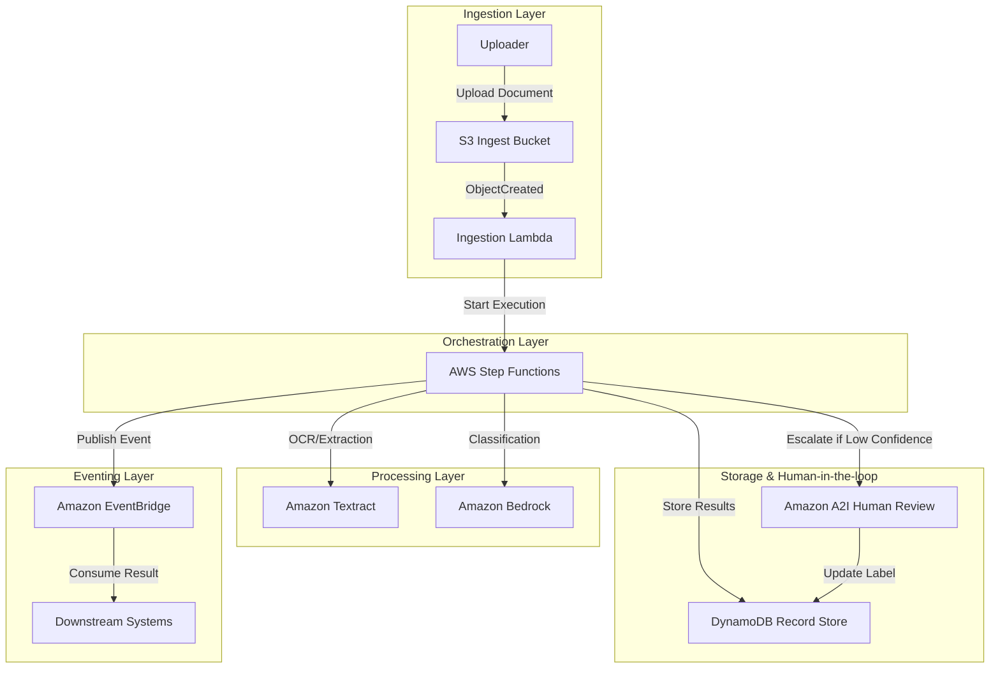
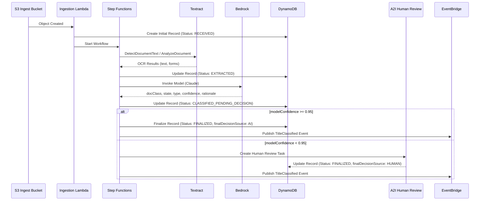
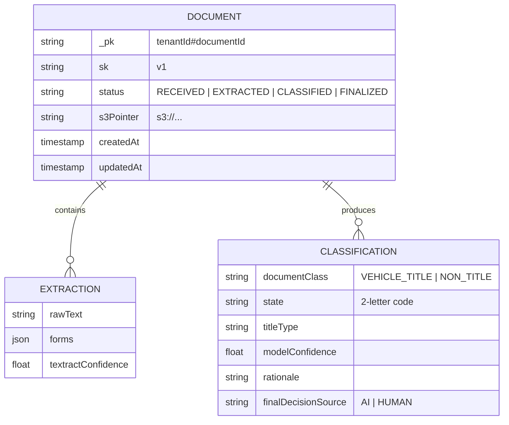
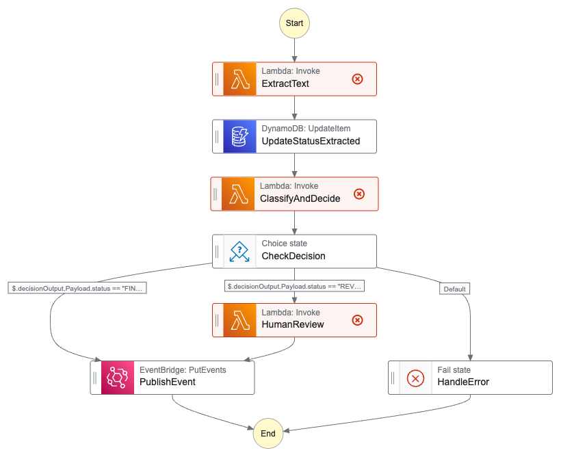

# Architecture Diagrams

This document outlines the architectural design for the Vehicle Title Classification Pipeline.

## 1. System Architecture Diagram

This diagram shows the high-level AWS components and their relationships.

## 2. Data Flow Diagram

The sequence of operations during document processing.

## 3. DynamoDB Data Model

Logical structure of the document records.

## 4. Step Functions Flow

Visualization of the AWS Step Functions workflow orchestration.

